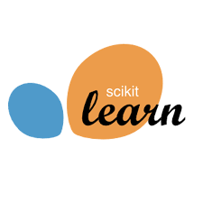
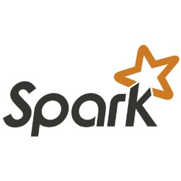
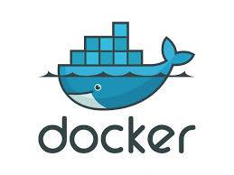

# 👋 Hi !! Mi nombre es Catalina Castelblanco-Data Scientist 👋
# 
💥¡Bienvenido a mi perfil de GitHub!💥

---

## 🚀 ¿Quién Soy?

**Soy una apasionada Data Scientist en evolución constante; estudiante de la Licenciatura en Economía. 🤓**

Mi viaje en el mundo de los datos comenzó en la universidad, donde descubrí mi amor por investigar y desentrañar conclusiones valiosas de grandes volúmenes de información. Por esto, me sumergí en el BootCamp de [SoyHenry](https://www.soyhenry.com/). para formarme como profesional de los datos!

A lo largo de mi experiencia laboral, he trabajado en roles de administración, ventas y ahora en el análisis de datos. 
Actualmente, disfruto mucho mi rol de Assistant Teacher en la carrera de Data Analytics, apoyando a estudiantes en su desarrollo y entendimiento del fascinante mundo de los datos.

## 🌟 ¿A Dónde Me Dirijo?

Mi objetivo es profundizar continuamente en el campo del Big Data, Data Science y Data Engineering. Estoy comprometida con el aprendizaje constante y la aplicación de nuevas tecnologías para resolver problemas complejos y generar impacto. Aspiro a colaborar en proyectos innovadores y aportar mi expertise para transformar datos en decisiones inteligentes y estratégicas.

## 🛠 Mis Tecnologías y Herramientas

Estas son algunas de las tecnologías y herramientas que más utilizo:

- **Python**: Mi lenguaje principal para programación y análisis de datos.
- **SQL y MySQL**: Utilizados para la gestión de bases de datos y manipulación de grandes volúmenes de información.
- **HadoopApache** : Permite el procesamiento distribuido de grandes conjuntos de datos en grupos de computadoras utilizando modelos de programación simples
- **PowerBi, Looker Studio y Streamlit**: Creación de dashboards interactivos para visualización y análisis de datos
- **Google Cloud**: Uso de servicios en la nube para procesamiento y almacenamiento de datos
---

## 📫 ¡Contactate conmigo!

Siéntete libre de conectarte conmigo aquí en GitHub o a través de

  [LinkedIn](https://www.linkedin.com/in/catalina-castelblanco/) 

   nadyacatalina99@gmail.com

¡Gracias por visitar mi perfil y explorar mi pasión por los datos!

                     

<!---
Cata09Castelblanco/Cata09Castelblanco is a ✨ special ✨ repository because its `README.md` (this file) appears on your GitHub profile.
You can click the Preview link to take a look at your changes.
--->
